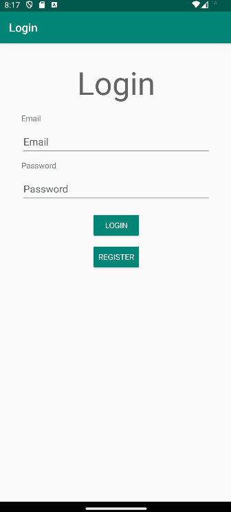

# The Shoe Store Inventory

This project is part of the Android Kotlin Developer Nanodegree from Udacity, it consists of five screens. 

1. Login screen: Email and password fields and labels plus create and login buttons
2. Welcome onboarding screen
3. Instructions onboarding screen
4. Shoe Listing screen
5. Shoe Detail screen for adding a new shoe

Project is built with ViewModel, LiveData, DataBinding, Navigation, ConstraintLayout

## Screenshots

## Requirements

* Android Studio

